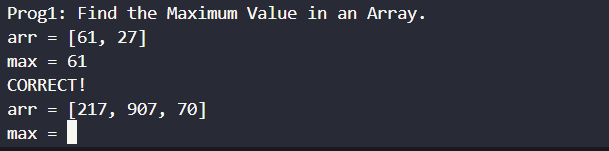

# Prog1
## Hướng Giải.
- Đề bài:
        
- Vì khá khó để giải thích nên mình up script lun cho dễ hiểu ạ.
```
#!/usr/bin/python3

from pwn import *
p = remote('103.162.14.116', 14002)

for i in range(100):
        p.recvuntil(b"arr = [")
        a = p.recvuntil(b']' , drop = True).decode()
        lst = a.split(", ")
        max = int(lst[0])
        for j in lst:
            if int(j) > max:
                max = int(j)
        p.sendlineafter(b'max = ' ,str(max).encode())
        

p.interactive()
```
`FLAG: KCSC{Ezzz_Programmingggg}`