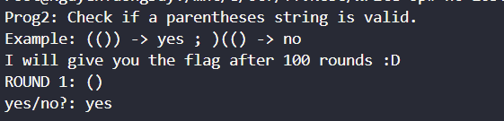

# Prog2
## Hướng Giải.
- Đề bài:
    
- Thuật toán của bài này khá khó nên mình search `poe.com` để kiếm hàm `isValid` như sau:
```
from pwn import*
p = remote('103.162.14.116',14003)

def isValid(s: str) -> bool:
    # Stack for left symbols
    leftSymbols = []
    # Mapping for right symbols to their corresponding left symbols
    symbolMap = {
        ')': '(',
        '}': '{',
        ']': '['
    }
    # Loop for each character of the string
    for c in s:
        # If left symbol is encountered
        if c in ['(', '{', '[']:
            leftSymbols.append(c)
        # If right symbol is encountered
        elif c in [')', '}', ']']:
            if len(leftSymbols) == 0 or leftSymbols[-1] != symbolMap[c]:
                return False
            leftSymbols.pop()
        # If none of the valid symbols is encountered
        else:
            return False
    return len(leftSymbols) == 0

for i in range(1,110):
    p.recvuntil(b': ')
    a = p.recvuntil(b"\n", drop =True)
    print(a)
    b = isValid(a.decode())
    if b == True:
        p.sendlineafter(b"yes/no?: ",b'yes')
    else:
        p.sendlineafter(b"yes/no?: ",b'no')
        
    p.recvuntil(b"!\n")
p.interactive()
```
`FLAG: KCSC{Smile_Emoji____:)___}`


