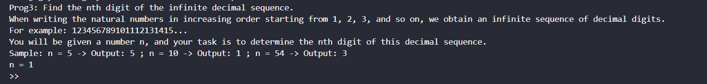

# Prog3
## Hướng Giải
- Đề bài :
    
- Thuật toán của bài này khá khó nên mình search `poe.com` để kiếm hàm `find_nth_digit` như sau:
```
#!/usr/bin/python3

from pwn import *
p = remote('103.162.14.116', 14004)
def find_nth_digit(n):
    # Bước 1: Xác định khoảng chứa số chữ số thứ n
    digits_count = 0
    length = 1
    base = 1

    while digits_count + length * 9 * base < n:
        digits_count += length * 9 * base
        length += 1
        base *= 10

    # Bước 2: Xác định số cụ thể chứa chữ số thứ n
    number = base + (n - digits_count - 1) // length

    # Bước 3: Xác định chữ số thứ n
    digit_index = (n - digits_count - 1) % length
    digit = int(str(number)[digit_index])

    return digit


p.recvuntil(b"3\n")
for i in range(100):
       
        p.recvuntil(b"n = ")
        n = p.recvuntil(b'\n', drop = True)
        print(n)
        result = find_nth_digit(int(n))
        p.sendlineafter(b">> ", str(result).encode())
        p.recvuntil(b"!\n")
               


p.interactive()
```
`FLAG: KCSC{dO_yOu_knOw_prOgrAmmIng_Is_vErY_ImpOrtAnt?}`