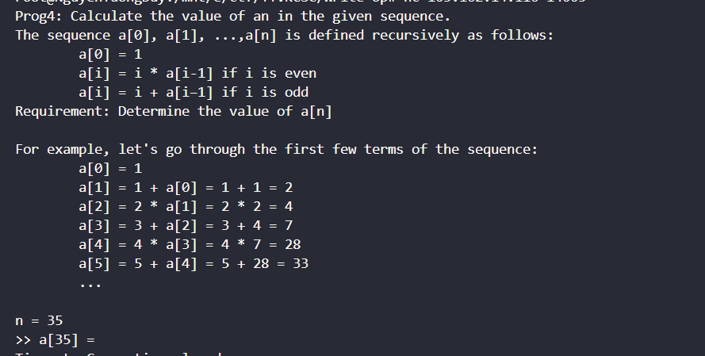

# Prog4
## Hướng Giải
- Đè bài:
    
- Vì khá khó để giải thích nên mình up script lun cho dễ hiểu ạ.
```
#!/usr/bin/python3

from pwn import *
p = remote('103.162.14.116', 14005)
a = [1,2]
for i in range(2,100):
        if i%2==0 :
                a.append(i * a[i-1]) 
        else :
                a.append(i + a[i-1]) 
        
for j in range(100):
        p.recvuntil(b'n = ')
        n = p.recvuntil(b'\n', drop = True)
        b = a[int(n)]
        print(b)
        p.sendlineafter(b"= ", str(b).encode())
               


p.interactive()
```
`FLAG: KCSC{KOREGA_REQUIEM_DA!!!_WWHaaaaaa___}`