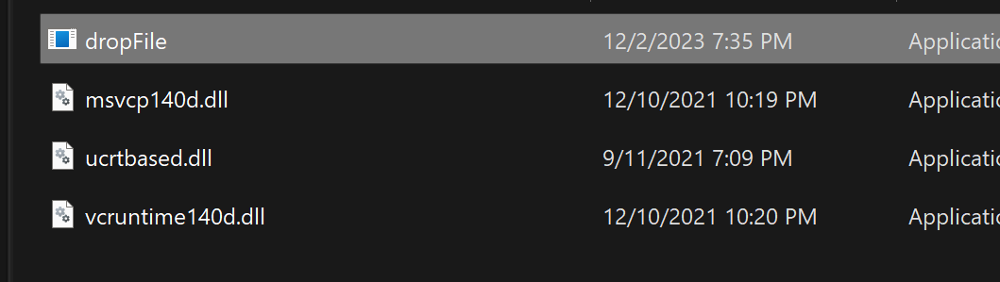
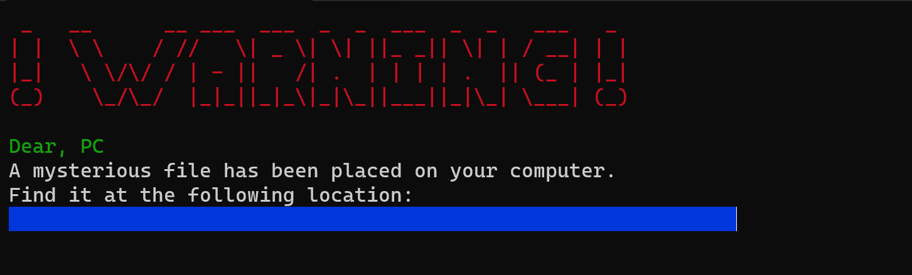
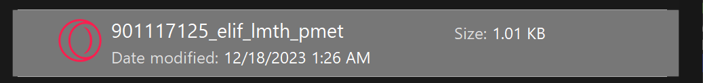
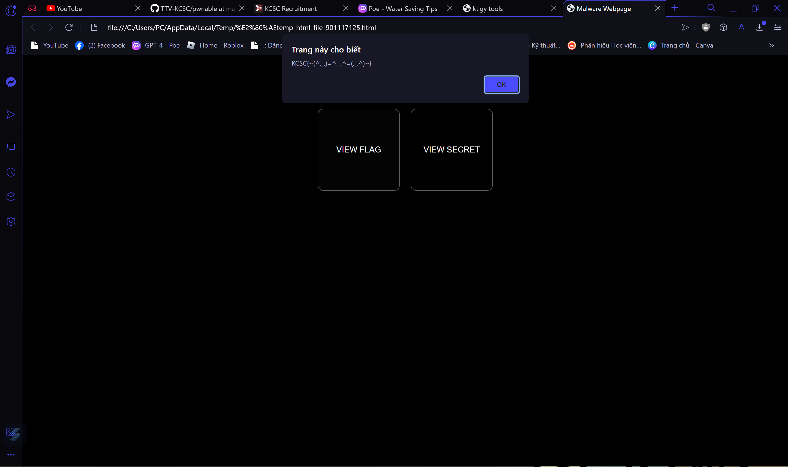

# hide and seek
## Hướng giải

- Mình chạy thử file này thì thấy cái này: 

- chall bảo rằng là đã có 1 file đã đc thêm vào máy của mình và nó nằm ở cái đoạn màu xanh , mình copy thử thì đc đoạn này `C:\Users\PC\AppData\Local\Temp\.temp_html_file_901117125.html`
- Mình lần theo địa chỉ thì mình kiếm ra đc file `html` này :

- Chạy thử fil thì mình tới 1 trang web , bấm vào `view flag` thì mình đã thu được flag ròi.

`FLAG: KCSC{~(^._.)=^._.^=(._.^)~}`