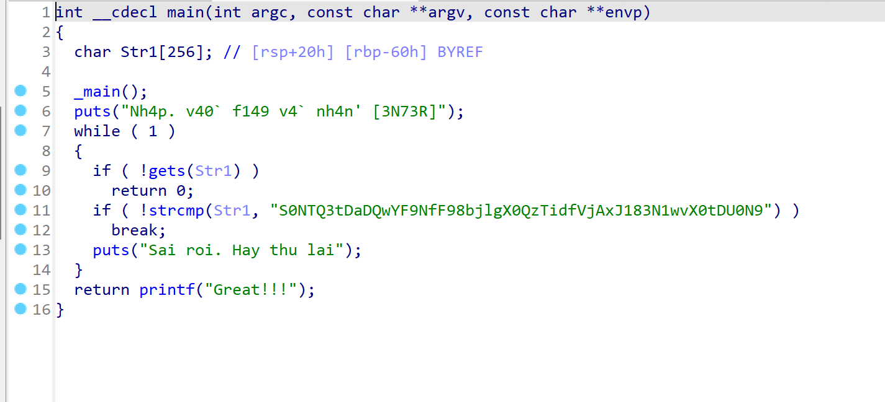
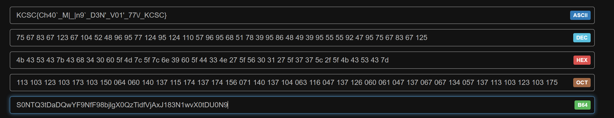

# Real Warmup
## Hướng Giải
- Bài này khá dễ check ida là ra flag.

- `S0NTQ3tDaDQwYF9NfF98bjlgX0QzTidfVjAxJ183N1wvX0tDU0N9` chuỗi này khá đáng nghi , mình nghi nó là `base64` mình decode thử.

`FLAG: KCSC{Ch40`_M|_|n9`_D3N'_V01'_77\/_KCSC}`